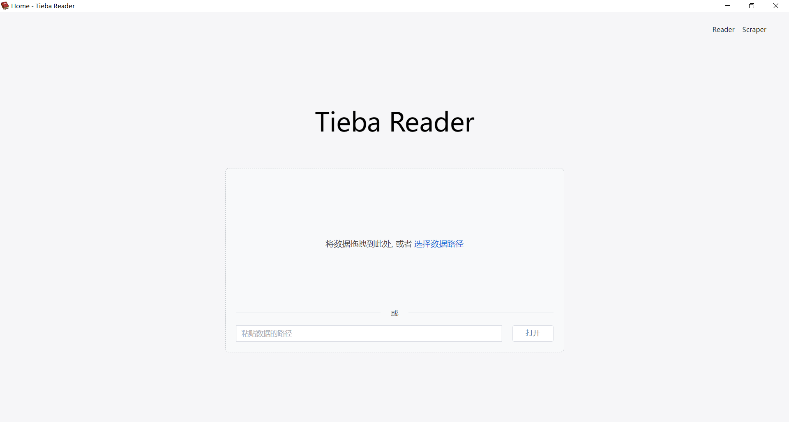
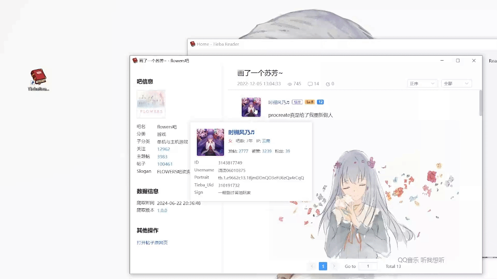

# TiebaReader

TiebaReader 是一个与 [TiebaScraper](https://github.com/Sorceresssis/TiebaScraper) 配套的阅读器。它能够更直观地展示 TiebaScraper 爬取到的贴吧帖子，并支持图片、语音、视频的查看和播放。

## 设想 & TODO

1. 搜索功能

模糊搜索帖子，点击直接跳转到楼层。

命中内容包括: FragText.text 、FragAt.text、FragLink.title、FragTiebaPlus.text、user.username、user.nickname、post.sign。

2. 楼层直接跳转

输入楼层数直接跳转到对应页面，并且滚动到楼层位置。

3. 适配其他类论坛数据。

如果实现了，就可以改名为 ForumReader 了。

所有的论坛类网站的帖子数据结构都大同小异。最大区别就是有些 subpost 的指向的是用户；有些指向是其他的 post ，形成一个树状的结构。

4. 过滤掉 user_id = 0 的查询请求。

## 截图

### 主页

用于选择要打开的 TiebaScraper 爬取的帖子数据。

### 主题帖页

## 其他使用技巧

### 图片可以直接拖出

## Notice

### EMOJI

本程序仅收录了贴吧默认的 EMOJI 表情，未收录全部表情包资源，因为这需要很大的工作量。未收录的表情会以字符串 `EMOJI(desc, type, id)` 的形式显示。

### 贴吧错误说明

[TiebaScraper: 贴吧错误说明](https://github.com/Sorceresssis/TiebaScraper/blob/main/docs/tieba_error_desc.md)
