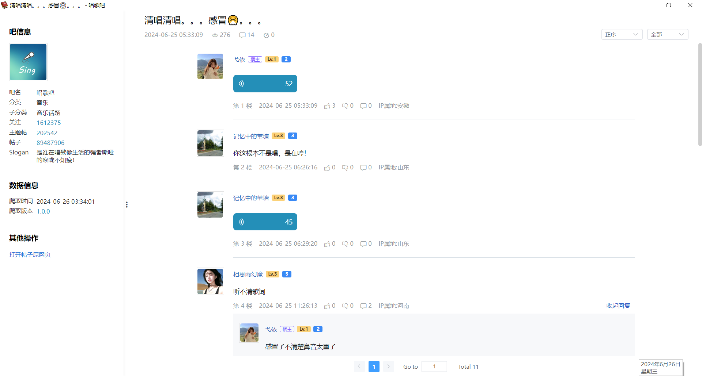

# TiebaReader

TiebaReader 是一个与 [TiebaScraper](https://github.com/Sorceresssis/TiebaScraper) 配套的阅读器。它能够更直观地展示 TiebaScraper 爬取到的贴吧帖子，并支持图片、语音、视频的查看和播放。

## 截图

### 主页

用于选择要打开的 TiebaScraper 爬取的帖子数据。

### 主题帖页

## 其他使用技巧

### 图片可以直接拖出

## Notice

### EMOJI

本程序仅收录了贴吧默认的 EMOJI 表情，未收录全部表情包资源，因为这需要大量的工作量。未收录的表情会以字符串 `EMOJI(desc, type, id)` 的形式显示。
